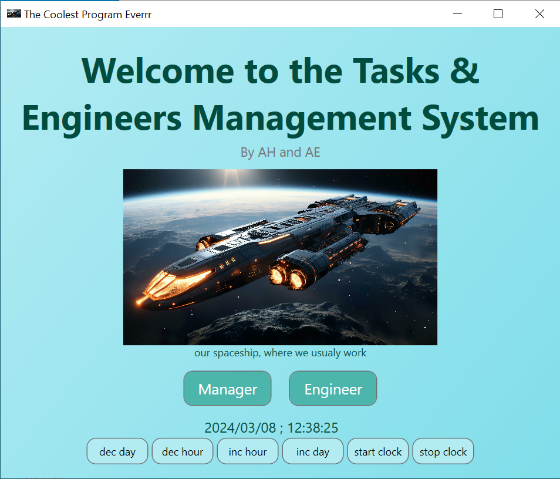

# Tasks & Engineers Management System
_by Azriel Ehrlich and Ariel Halili_

### What is this?
This project is a management system for tasks and engineers. Using this app allow you to create list of tasks and assign an engineer for each task. Finally, you can see a gantt chart of your full project.

This project created during "Mini Project in Windows Systems" course at JCT.

> NOTE: This app uses .NET 8 

### Special additions
* Awesome graphics
* Automatic schedule
* Icons for windows
* Restore deleted tasks and engineers
* Saving the clock between runs (so you can continue from the last time)

### Screenshot

